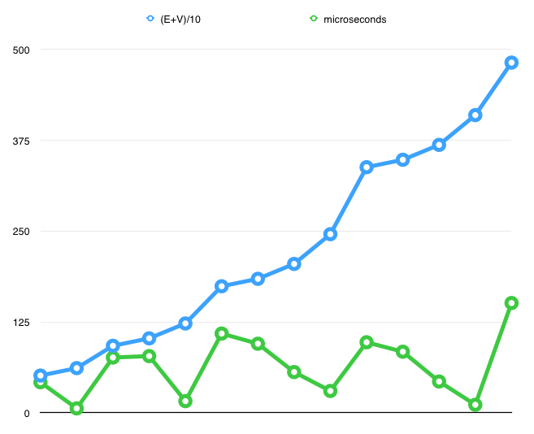
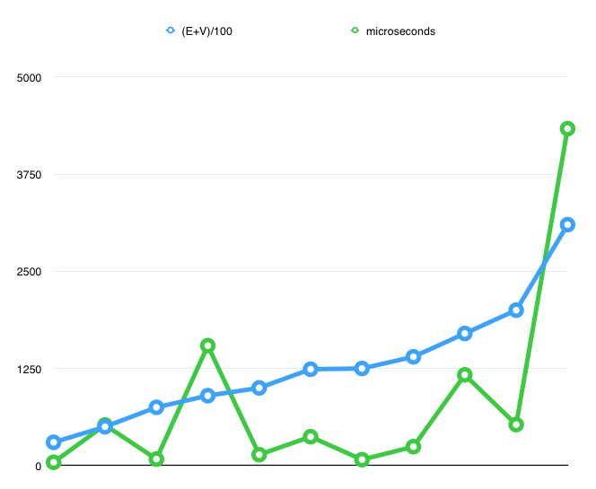
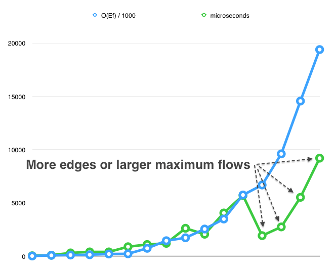

# Image Segmentation Using Ford-Fulkerson
- Michael Crouse and Christopher Stoll
- Dr. Duan
- 635 Advanced Algorithms
- February 10, 2014

The objecive of this project was to use the Ford-Fullkerson network flow algorithm to solve an image segmentation problem. The use of breadth first search (BFS) was required to find paths from the source node to the sink node in the Ford-Fullkerson algorithm. To apply a flow network to segmenting an image, each pixel in the image was treated as a vertex within a flow network. Each vertex was connected to adjecnt vertecis by edges forming a von Neumann neighborhood with a range of one. The capacity of the edges was determined by the difference in the pixels' z-dimensions. Since the images used in this project were grey-scale, the z-dimension was the 8-bit darkness of the pixel; a black pixel had a z value of 0 and a white pixel had a z value of 255.

For the purposes of this project, the goal of image segmentation was to seperate the background from the foreground of the greyscale image and either white-out or black-out the background of the image. In order to find the boundary between the foreground and the background we searched for the line of highest contrast, this is where the z-dimension differences are the highest; the z-dimension difference between a white pixel, with a value of 255, and a black pixel, with a vlaue of 0, is 255. That line of maximum contrast should corespond to the the minimum cut. According to the max-flow min-cut theorum, the maximum flow from the source to the sink of a flow network coresponds with the minimum cut required to stop the flow from the source to the sink. So, after the Ford-Fulkerson algorithm is run we can berform another breadth first search on the residual graph from the source out to where the residual cpacity is zero. This defines an area that should corespond to the background of the image.

We started by implementing breadth first search. We decided to use C, so we had to create node and graph structures as well as functions for handling queues and stacks. The graph was implemented using an adjacency matrix to reduce memory complexity even though this made the programming slightly more chalanging.

Once the breadth first search was implemented we ran some analysis to verify that it was performing as expected. We expected that in the worst case breadth first search should run in (|E| + |V|) time. The chart below show the results of our emperical analysis for a number of various sized graphs. Each graph was run 25 times, obvious outliers were excluded, then the times were averaged. The (|E| + |V|) values were scaled down so that the initial points roughly corespond; this is to make the asyptotes easier to compare. The time taken to run each graph does not form a smooth asymtote, this is due to differences in the graph desnisties. We used different densities to check a wider range of operating parameters.

It is worth noting that, even with very large graphs, our unoptimized C implementation of the breadth first search, as well as Ford-Fulkerson, ran so quickly that we had to measure run-times in microsoeconds (1/1,000,000 second). On these small time scales it seems that the impact of operating system optimizations, such as Timer Coalescing on OS X Mavericks, have a large impact upon run-times. We ran our analysis program multiple times, and occasionaly a graph would report taking orders of magnitudes longer to run. We used averages and outlier exclusion to counter this, but the operating system overhead constants seem to have an outsized impact at this time scale.

| V | E | (E+V)/10 | (E+V)/100 | microseconds |
|---|---|----------|-----------|--------------|
| 256 | 1024 | 51.2 | 12.8 | 42 |
| 512 | 1024 | 61.44 | 15.36 | 6 |
| 256 | 2048 | 92.16 | 23.04 | 76 |
| 512 | 2048 | 102.4 | 25.6 | 78 |
| 1024 | 2048 | 122.88 | 30.72 | 16 |
| 256 | 4096 | 174.08 | 43.52 | 109 |
| 512 | 4096 | 184.32 | 46.08 | 95 |
| 1024 | 4096 | 204.8 | 51.2 | 56 |
| 2048 | 4096 | 245.76 | 61.44 | 30 |
| 256 | 8192 | 337.92 | 84.48 | 97 |
| 512 | 8192 | 348.16 | 87.04 | 84 |
| 1024 | 8192 | 368.64 | 92.16 | 43 |
| 2048 | 8192 | 409.6 | 102.4 | 11 |
| 2048 | 9999 | 481.88 | 120.47 | 151 |

| V | E | (E+V)/10 | (E+V)/100 | microseconds |
|---|---|----------|-----------|--------------|
| 10000 | 20000 | 1200 | 300 | 43 |
| 10000 | 40000 | 2000 | 500 | 523 |
| 25000 | 50000 | 3000 | 750 | 84 |
| 10000 | 80000 | 3600 | 900 | 1544 |
| 30000 | 70000 | 4000 | 1000 | 141 |
| 25000 | 99000 | 4960 | 1240 | 372 |
| 25000 | 100000 | 5000 | 1250 | 77 |
| 40000 | 100000 | 5600 | 1400 | 244 |
| 30000 | 140000 | 6800 | 1700 | 1168 |
| 40000 | 160000 | 8000 | 2000 | 528 |
| 30000 | 280000 | 12400 | 3100 | 4335 |

Once the breath first search was working as expected we implemented the Ford-Fulkerson algorithm. Analysis shows that our Ford-Fulkerson performs in O(Ef), the number of edges times the maximum flow, as expected. Perhaps due to the operating system overhead constants mentioned above, the algorith performs realtively better on larger graphs or graphs with larger maximum flows.

| V | E | flow | O(Ef) / 1000 | microseconds |
|---|---|------|--------------|--------------|
| 1024 | 2048 | 8 | 16.384 | 39 |
| 2048 | 4096 | 19 | 77.824 | 92 |
| 1024 | 4096 | 26 | 106.496 | 306 |
| 256 | 1024 | 128 | 131.072 | 401 |
| 512 | 2048 | 99 | 202.752 | 401 |
| 2048 | 8192 | 27 | 221.184 | 886 |
| 256 | 2048 | 360 | 737.28 | 1096 |
| 2048 | 9999 | 145 | 1449.855 | 1203 |
| 512 | 4096 | 421 | 1724.416 | 2618 |
| 1024 | 8192 | 311 | 2547.712 | 2058 |
| 256 | 4096 | 851 | 3485.696 | 4056 |
| 512 | 8192 | 701 | 5742.592 | 5700 |
| 10000 | 40000 | 167 | 6680 | 1925 |
| 40000 | 160000 | 60 | 9600 | 2745 |
| 30000 | 140000 | 104 | 14560 | 5522 |
| 256 | 8192 | 2367 | 19390.464 | 9198 |

Finally, after Ford-Fulkerson was complete, we were able to implement the image segementaiton portion of the program. We started by adding in code which can read and write PGM files. Since the files represented an image we used a matrix to store the points. We then created a graph with all the associated edges. The difference in z-value was used as the capacity of the edge. In order to select our source and sink we originally added an external source connected to all the nodes on the left and right sides of the image. We were not getting the results we expected, so we changed the program to search the image matrix for the darkest and lightest regions, then attached the source node to the dark vertecis and the sink node to the lightest vertecis. The idea was to search out from the dark regions where flow should be the highest, stopping at the minimum cut. The effect of this approach, however, was that the dark regions were cut out of the image instead of the light regions. Despite the dark regions being cut out instead of the light regions, the rpogram is functioning as required; the results are just inverted.

For future projects in which we are unfamiliar with the algorithms involved, we beleive tha it may be easier to use a higher level language than C, at least until all the implementation steps are well understood.